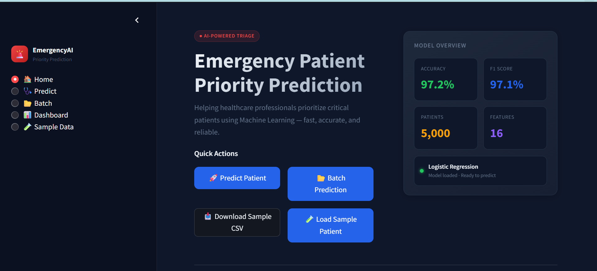
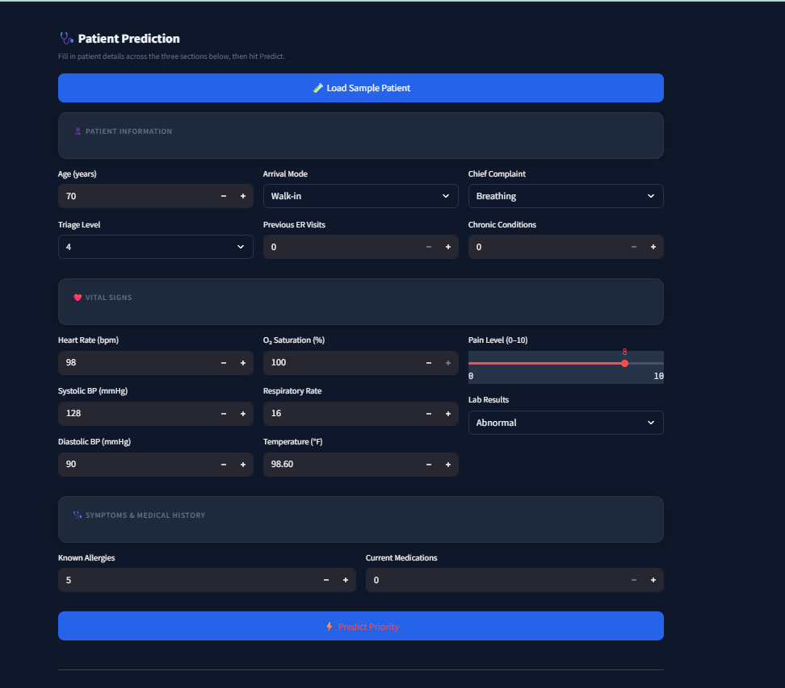
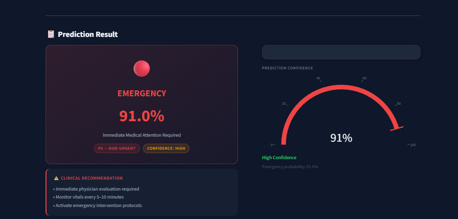
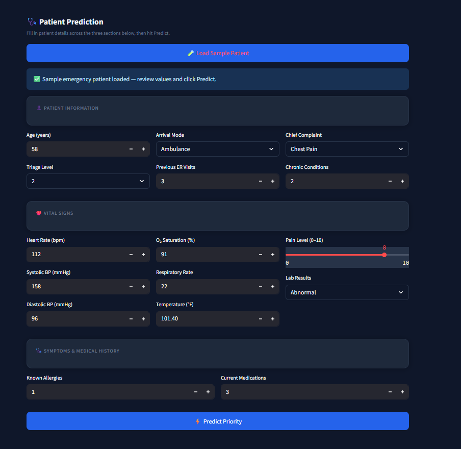
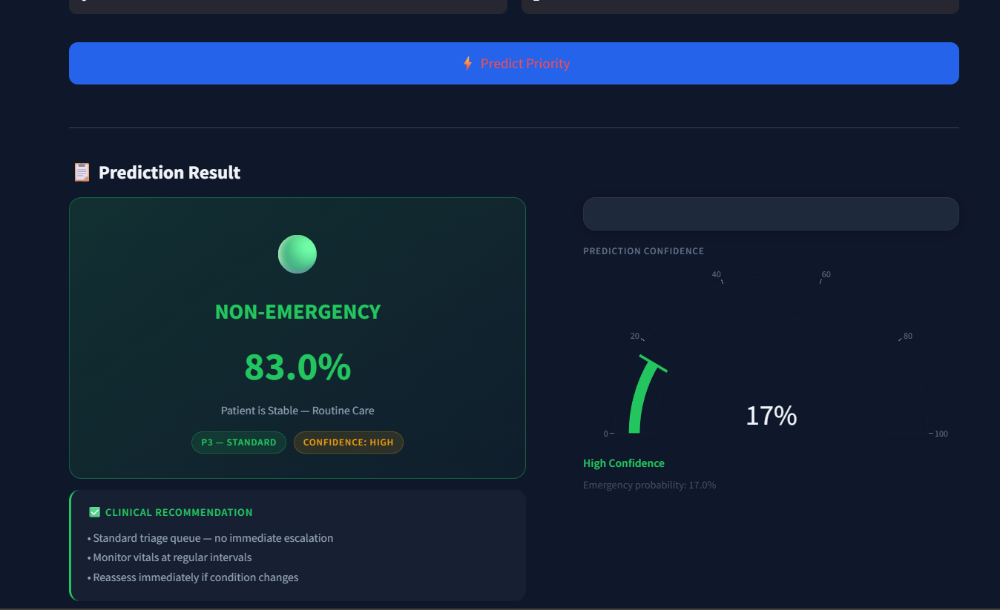
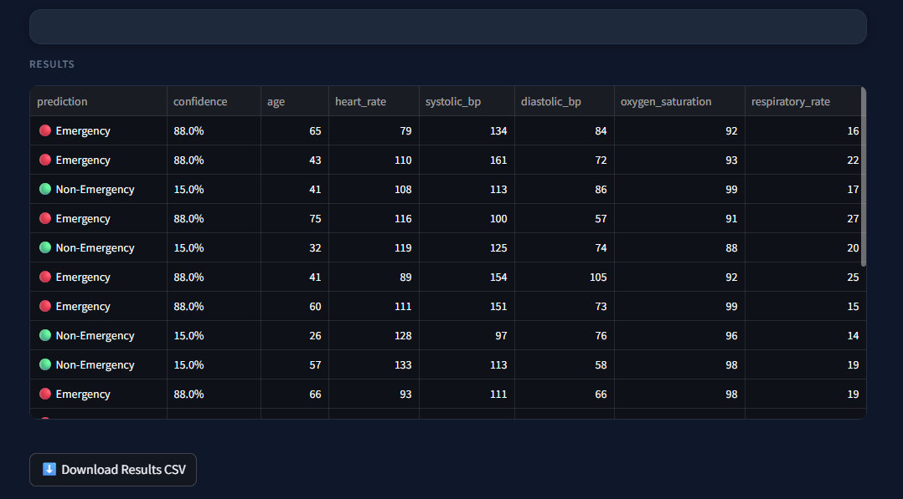
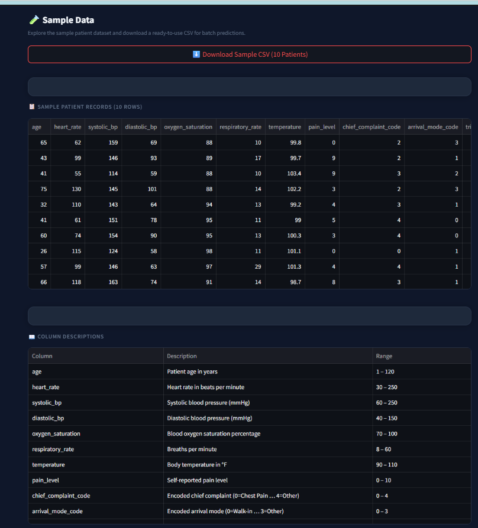
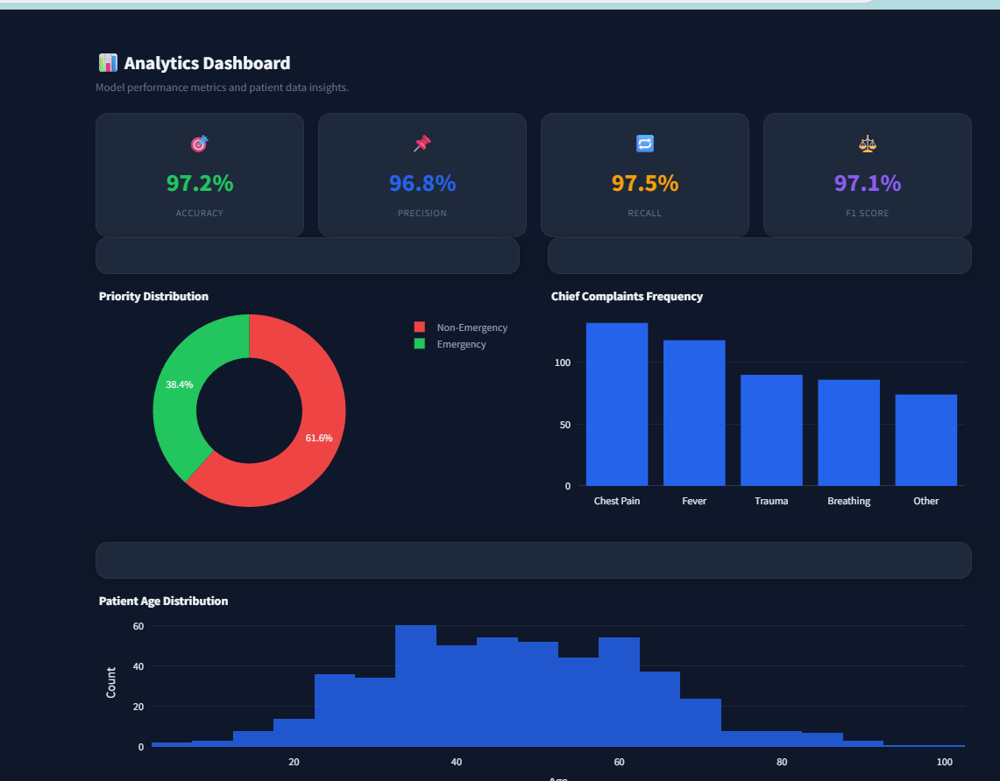

# 🚑 AI Emergency Patient Priority Prediction System

<p align="center">
  
</p>

<p align="center">
An AI-powered Machine Learning application that predicts whether a patient requires <b>High Priority</b> or <b>Low Priority</b> emergency care based on vital signs and symptoms.
</p>

<p align="center">


</p>

---

# 📑 Table of Contents

- [Project Overview](#-project-overview)
- [Features](#-features)
- [Tech Stack](#-tech-stack)
- [Dataset](#-dataset)
- [Machine Learning Workflow](#-machine-learning-workflow)
- [Project Structure](#-project-structure)
- [Application Screenshots](#-application-screenshots)
- [Exploratory Data Analysis](#-exploratory-data-analysis)
- [Model Performance](#-model-performance)
- [Installation](#-installation)
- [Usage](#-usage)
- [Future Improvements](#-future-improvements)
- [Author](#-author)

---

# 📌 Project Overview

Emergency rooms receive multiple patients simultaneously, making quick and accurate triage essential.

This project uses **Logistic Regression** to classify patients into:

- 🔴 **High Priority** — Requires immediate medical attention
- 🟢 **Low Priority** — Can be managed with standard care

based on medical information such as:

- Heart Rate
- Blood Pressure
- Oxygen Saturation
- Respiratory Rate
- Chest Pain
- Difficulty Breathing
- Pain Severity
- Previous Medical History
- Arrival Mode
- Age
- Body Temperature

The model achieves **97.20% accuracy** on the test set, making it a highly reliable tool for supporting emergency triage decisions.

---

# ✨ Features

- ✅ Machine Learning Prediction (Logistic Regression)
- ✅ Interactive Streamlit Web App
- ✅ Individual Patient Prediction Form
- ✅ **Batch CSV Prediction** — Upload multiple patients at once
- ✅ Sample Data Auto-Fill for quick testing
- ✅ Clean & Professional User Interface
- ✅ Instant Prediction with Confidence Score
- ✅ Feature Scaling & Label Encoding
- ✅ Data Visualizations & EDA Dashboard
- ✅ 97.20% Test Accuracy
- ✅ Easy Local Deployment

---

# 🛠 Tech Stack

| Category | Technology |
|----------|------------|
| Language | Python 3.11 |
| ML | Scikit-Learn |
| Data | Pandas, NumPy |
| Visualization | Matplotlib, Seaborn |
| Deployment | Streamlit |
| Model Saving | Joblib |

---

# 📊 Dataset

The dataset contains patient medical records including:

- Age
- Heart Rate
- Blood Pressure
- Oxygen Saturation
- Body Temperature
- Respiratory Rate
- Chest Pain
- Difficulty Breathing
- Consciousness Level
- Pain Severity
- Previous Medical History
- Arrival Mode

**Target Variable**

```
Emergency Priority
```

- `0` → Low Priority
- `1` → High Priority

---

# 🤖 Machine Learning Workflow

```
Dataset
     │
     ▼
Data Cleaning
     │
     ▼
EDA
     │
     ▼
Feature Engineering
     │
     ▼
Label Encoding
     │
     ▼
Feature Scaling
     │
     ▼
Train Test Split
     │
     ▼
Logistic Regression
     │
     ▼
Model Evaluation
     │
     ▼
Streamlit Deployment
```

---

# 📂 Project Structure

```
Emergency-Patient-Priority-Prediction/
│
├── assets/
│   ├── HomePage.png
│   ├── EmergencyInput.png
│   ├── Emergency_Predication.png
│   ├── NonEmergencyInput.png
│   ├── NonEmergency_Predication.png
│   ├── BatchCSV_Input.png
│   ├── Batch_csv_Output.png
│   ├── SampleData.png
│   └── Visualization.png
│
├── app.py
├── improved_emergency_triage_dataset.csv
├── logistic_regression_model.pkl
├── scaler.pkl
├── feature_columns.pkl
├── label_encoder.pkl
├── requirements.txt
└── README.md
```

---

# 🖥️ Application Screenshots

## 🏠 Home Page


---

## 🔴 High Priority — Patient Input



---

## 🔴 High Priority — Prediction Result



---

## 🟢 Low Priority — Patient Input



---

## 🟢 Low Priority — Prediction Result



---

## 📂 Batch CSV Upload — Output



---

## 🧪 Sample Data Auto-Fill



---

## 📊 Data Visualizations



---

# 📈 Model Performance

## Evaluation Metrics

| Metric | Score |
|--------|-------|
| **Training Accuracy** | 97.58% |
| **Testing Accuracy** | 97.20% |
| **Precision** | 97.83% |
| **Recall** | 97.50% |
| **F1 Score** | 97.66% |

---

## Confusion Matrix

|  | Predicted: Low Priority (0) | Predicted: High Priority (1) |
|--|--|--|
| **Actual: Low Priority (0)** | TN = 387 | FP = 13 |
| **Actual: High Priority (1)** | FN = 15 | TP = 585 |

- **True Negatives (TN):** 387 — Correctly predicted Low Priority
- **False Positives (FP):** 13 — Low Priority incorrectly flagged as High
- **False Negatives (FN):** 15 — High Priority incorrectly flagged as Low
- **True Positives (TP):** 585 — Correctly predicted High Priority

> ⚠️ In a medical triage context, minimizing **False Negatives** is critical — the model keeps FN at just **15**, meaning very few high-priority patients are missed.

---

## Classification Report

| Class | Precision | Recall | F1 Score | Support |
|-------|-----------|--------|----------|---------|
| **0 — Low Priority** | 0.96 | 0.97 | 0.97 | 400 |
| **1 — High Priority** | 0.98 | 0.97 | 0.98 | 600 |
| **Overall Accuracy** | — | — | **0.97** | 1000 |

---

# 🚀 Installation

**Clone the repository**

```bash
git clone https://github.com/AbhayDw/Emergency-Patient-Priority-Prediction.git
```

**Move into the project**

```bash
cd Emergency-Patient-Priority-Prediction
```

**Install dependencies**

```bash
pip install -r requirements.txt
```

**Run the application**

```bash
streamlit run app.py
```

---

# 💻 Usage

### Individual Prediction
1. Enter the patient's medical information in the input form.
2. Click **Predict**.
3. View the predicted emergency priority with confidence score.

### Batch Prediction
1. Prepare a CSV file with patient records.
2. Upload via the **Batch CSV Upload** section.
3. Download the results with predictions for all patients.

### Quick Testing
- Use the **Sample Data** button to auto-fill example patient values and test the model instantly.

---

# 🔮 Future Improvements

- 🧠 Deep Learning Models (Neural Networks)
- 🔍 Explainable AI (SHAP / LIME)
- 🏥 Hospital Database Integration
- 📡 Real-Time Patient Monitoring
- 🎯 Multi-Class Priority Prediction (Critical / Urgent / Standard)
- ☁️ Cloud Deployment (AWS / GCP / Azure)
- 📱 Mobile-Friendly Interface

---

# 👨‍💻 Author

## Abhay Dwivedi

**B.Tech CSE (Cyber Security) | Data Science & ML Enthusiast**

### Connect with me

- 🐙 GitHub: [github.com/AbhayDw](https://github.com/AbhayDw)
- 💼 LinkedIn: [linkedin.com/in/abhay-dwivedi-6a8aa4279](https://www.linkedin.com/in/abhay-dwivedi-6a8aa4279/)

---

# ⭐ Support

If you found this project useful,

⭐ **Please give this repository a Star.**

It motivates me to build more Machine Learning projects.

